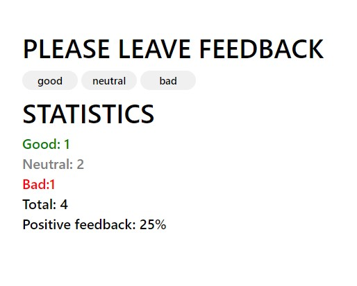

# React feedback with React hooks

## The code of this application was refactored: [feeback](https://github.com/GnatykOleg/react-feedback) using React hooks (useState, useEffect)

#### 1. An application for collecting statistics has been created. There are only three options for the return connections: good, neutral, and bad.

#### 2. The app displays the number of reviews collected for each category. The application does not save feedback statistics between different sessions (update pages). The state of the application is as follows: state = { good: 0, neutral: 0, bad: 0 }

#### 3. Expanded the functionality of the application so that the interface displays more statistics about the collected reviews. Added display of the total number of collected reviews from all categories and the percentage of positive reviews. For This created the helper methods countTotalFeedback() and countPositiveFeedbackPercentage() which counts these values ​​based on data in the state (computed data).

#### 4. The application has been refactored. The application state should remain in the root <App> component.

- Moved the display of statistics to a separate component
  <Statistics good={} neutral={} bad={} total={} positivePercentage={}>.

- Moved the block of buttons to the component
  <FeedbackOptions options={} onLeaveFeedback={}>.
- Created a Section title="" component that renders a section with a title and
  children (children). Wrapped each of <Statistics> and <FeedbackOptions> in
  created section component.

#### 5. Expanded the functionality of the application so that the statistics block is rendered only after how at least one review was collected. Missing statistics message moved to the <Notification message="There is no feedback"> component.

